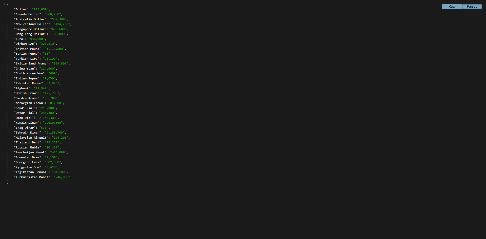

<h2 align="center">Real-time currency prices with Django REST framework 💸</h2>
<div align="center">
  
  
  
  
  
  
  
  
  
  
</div>

###


<p align="left">Real time currency prices with DRF</p>

###

<h3 align="left">Demo Screeshots 🖼️</h3>

###


<div align="center">
  
</div>

###


<div align="center">
  
</div>

###

<h3 align="left">Install requirements 🔧</h3>

- **Python** 🦴
- **Django** 💚

<br>

Download Project ⏬
```bash
git clone https://github.com/cymilad/django_resume.git
```

Open Windows Terminal And Install Library requirement for Run Project 🛠️
```bash
pip install -r requirements.txt
```

Open Browser Go to Url : http://127.0.0.1:8000 🌐
```bash 
python manage.py runserver
```

###

<h3 align="left">Contact Author 👨‍💻</h3>

<p>
  You can contact me through the following communication channels
</p>

[](https://instagram.com/cyberamooz) [](https://youtube.com/@cyberamooz) [](https://t.me/cymilad) [](mailto:milad1418@yahoo.com)

###
