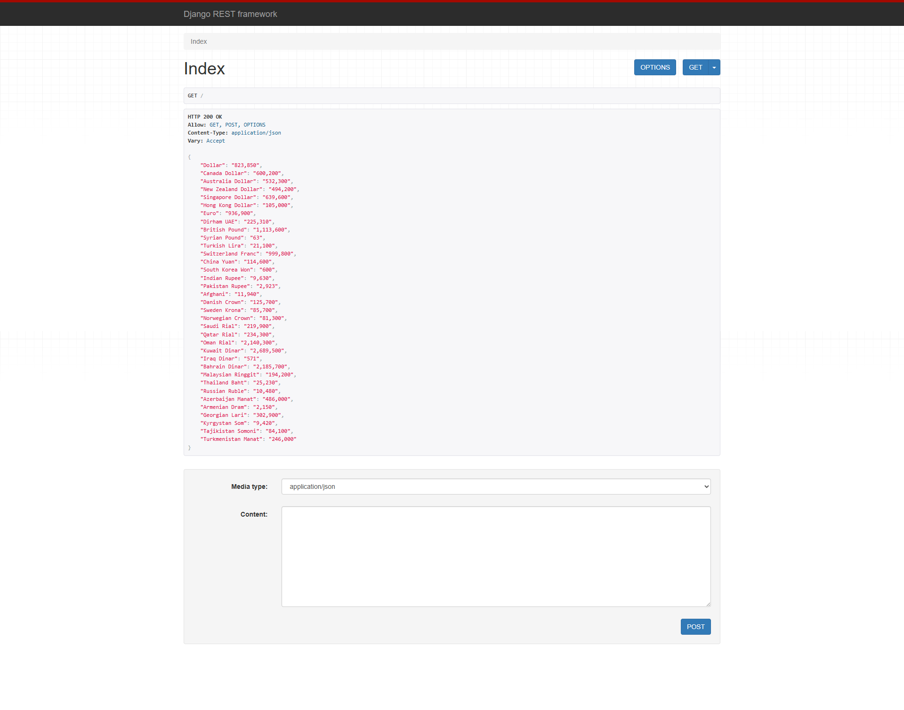

<h2 align="center">Real-time currency prices with Django REST framework 💸</h2>

  
  
  
  
  
  
  
  
  
  

###

Real time currency prices with DRF

###

<h3 align="left">Demo Screeshots 🖼️</h3>

###

  

###
